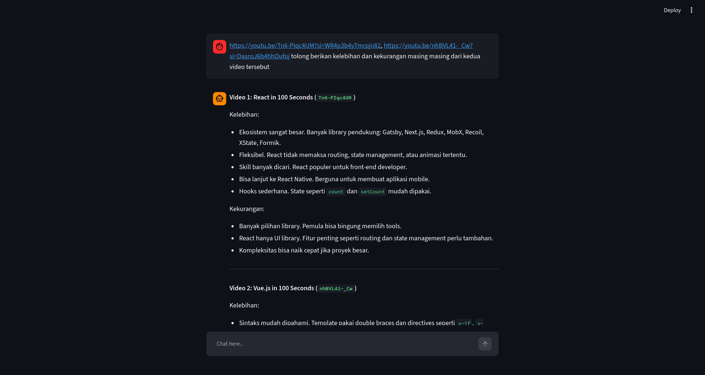

# Simple Youtube Chatbot

created with langchain and streamlit



# 🧑‍💻 | About Project

This is a simple project when boring. so basically this just create a RAG system and tool calling agent. stack that i use to create this systems are Langchain and Streamlit. you can use this project for fun or just test the project lol.

# 🛠️ | Quick Start

1.  clone this repository

```bash
git clone https://github.com/R1TGAMING/youtube-chatbot
```

2. change the directory

```bash
cd youtube-chatbot
```

3.install requirement depedencies

```bash
pip install -r requirements.txt
```

if use uv

```bash
uv add -r requirements.txt
```

4. copy `.env.example` files and fill the environment files

```bash
cp .env.example .env
```

5. run the program

```bash
streamlit run main.py
```

access `http://localhost:8501` to the browser.

# Thank You ❤️❤️

feel free to add several issues or feedback.
